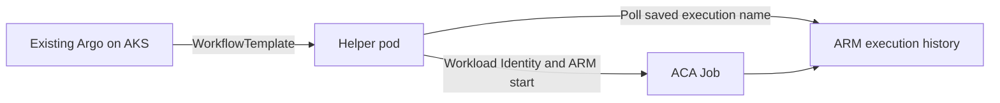

# Argo Workflows on Azure Container Apps Jobs

[](https://github.com/hetvip2/argo-workflows-on-aca-jobs/actions/workflows/ci.yml)

Run workload containers as Azure Container Apps (ACA) Jobs while your existing Argo Workflows installation remains the control plane.

**Ownership boundary:** this existing-mode template does not deploy AKS, Argo Server, the workflow controller, artifact storage, or an Argo database. You operate those components. The template provisions a sample ACA Job and an Azure identity federated to one Kubernetes service account.



Use this when Argo 3.5+ already runs on an AKS cluster with OIDC issuer and Azure Workload Identity enabled. Do not use it to host Argo or to run an interactive service as an ACA Job.

## Prerequisites

- Argo Workflows 3.5 or 3.6 on Kubernetes 1.29+
- Node.js 20.15+ for helper development; the image pins Node 22.17
- Docker, Azure CLI, Azure Developer CLI, and kubectl
- An AKS OIDC issuer URL and permission to create a federated identity and role assignment

## Quickstart

No Azure command below is run by CI. Review cost and scope before deployment.

PowerShell:

```powershell
$env:AKS_OIDC_ISSUER_URL = az aks show -g <aks-rg> -n <aks-name> --query oidcIssuerProfile.issuerUrl -o tsv
azd auth login
azd env new argo-aca-dev
azd env set AZURE_LOCATION eastus2
azd up
```

Linux/macOS:

```bash
export AKS_OIDC_ISSUER_URL="$(az aks show -g <aks-rg> -n <aks-name> --query oidcIssuerProfile.issuerUrl -o tsv)"
azd auth login
azd env new argo-aca-dev
azd env set AZURE_LOCATION eastus2
azd up
```

Build and push the helper to a registry your AKS cluster can pull, replace the four `REPLACE_*` values in `workflows/`, then apply them:

```bash
docker build -t <registry>/argo-aca-helper:0.1.0 .
docker push <registry>/argo-aca-helper:0.1.0
kubectl -n argo apply -f workflows/service-account.yaml -f workflows/workflow-template.yaml
argo -n argo submit --from workflowtemplate/aca-jobs --watch
argo -n argo submit --from workflowtemplate/aca-jobs --entrypoint fan-out-five --watch
```

## Offline and local validation

```bash
npm ci
npm run check
docker build -t argo-workflows-on-aca-jobs:test .
az bicep build --file infra/main.bicep
```

The local smoke uses kind, the Argo controller/CLI, and a controlled ARM stub to exercise single, five-way fan-out/fan-in, and terminal-failure behavior through the public `argo submit` path.

## Workloads, retries, and durability

Override `target-image`, `command-json`, `args-json`, `env-json`, `cpu`, `memory`, `job-name`, and timeout as Argo parameters. The helper retries only HTTP 429 and transient 5xx responses, honors `Retry-After`, refreshes once after 401, redacts response bodies, emits `argo-workflows-on-aca-jobs/0.1.0`, and propagates `{{workflow.uid}}-<shard>` as the ARM client request ID.

The start node outputs the stable ACA execution name into Argo node state. The wait node consumes that name, so wait retries resume without starting another execution. A failed/canceled ACA execution fails the Argo DAG and suppresses dependents. Deleting an Argo workflow does not cancel a running ACA execution; cancel it explicitly through ARM after confirming the execution identity.

The fan-out entry point creates five independent ACA executions by default.

## Production concurrency

`fan-out-five` uses Argo's native `withSequence` and accepts `shard-count` from `1` through `50`; omitting it preserves the five-shard default. Submit a 25-shard definition with:

```bash
argo -n argo submit --from workflowtemplate/aca-jobs --entrypoint fan-out-five -p shard-count=25 --watch
```

Capture the Argo workflow name, phase, shard node count, fan-in phase, ACA execution names, ACA execution statuses, and each `x-ms-client-request-id` (`<workflow UID>-<shard>`) as evidence. Tune Argo parallelism, ACA Job replica limits, ARM throttling, and poll interval using observed behavior in your environment.

Only the default five-way fan-out has live proof in this repository. The 25-shard definition is covered by offline tests; 25- and 50-shard runs have not been measured, so this repository makes no throughput, quota, or completion-time claim for them.

## Authentication and least privilege

`DefaultAzureCredential` uses the projected AKS workload identity token in production and Azure CLI locally. Never place access tokens in workflow parameters. The Bicep quickstart assigns the built-in Container Apps Jobs Operator role at the single sample Job scope. For tighter production access, replace it with a custom role containing only the job and execution actions your workflows use.

## Infrastructure and cleanup

The Bicep file uses stable `Microsoft.App` API `2024-03-01`, creates Log Analytics, an ACA environment, one manual Job, one user-assigned identity, federation, and job-scoped RBAC. The orchestrator and helper registry are intentionally external.

```bash
kubectl -n argo delete -f workflows/workflow-template.yaml -f workflows/service-account.yaml
azd down --purge
```

## Validation status

CI, the real local kind/Argo smoke, Bicep compilation, clean-clone validation, dedicated secret scanning, and independent review are complete. Native AKS OIDC/workload-identity validation against live ARM completed with successful single-job and five-way fan-out workflows and six matching successful ACA executions. Status: **LIVE VALIDATED**.

## Troubleshooting

- `401`: verify the service account label/annotation, pod label, federated issuer/subject/audience, and projected token.
- `403`: verify role assignment scope and propagation; do not log tokens to diagnose it.
- `404`: confirm subscription, resource group, job name, and API version.
- Timeout: inspect ACA execution history using the logged execution name; increasing Argo retries does not increase the execution timeout.
- Image pull failure: grant the AKS kubelet identity `AcrPull` or configure the existing cluster's approved registry credential path.

## Project structure and license

`src/` contains the reusable ARM helper, `workflows/` the native Argo resources, `infra/` azd Bicep, and `test/` offline behavior tests. Licensed under Apache-2.0.
